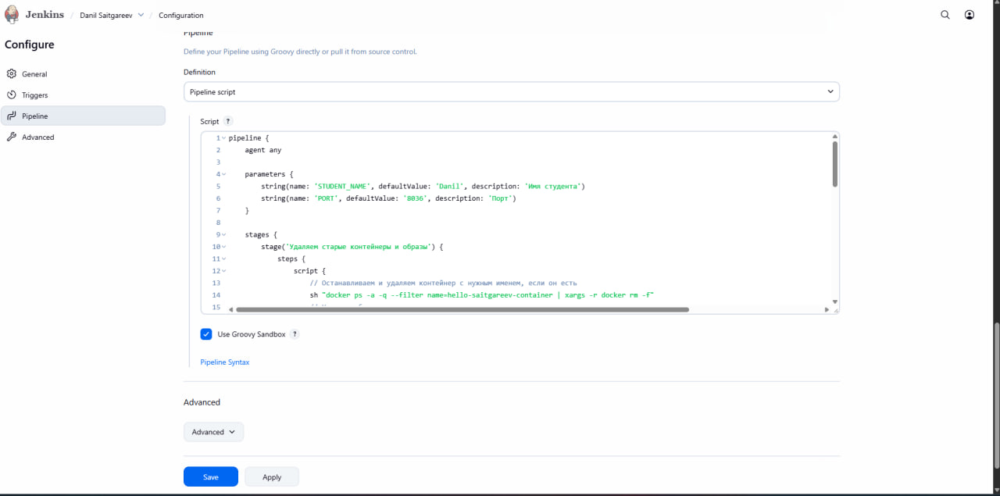
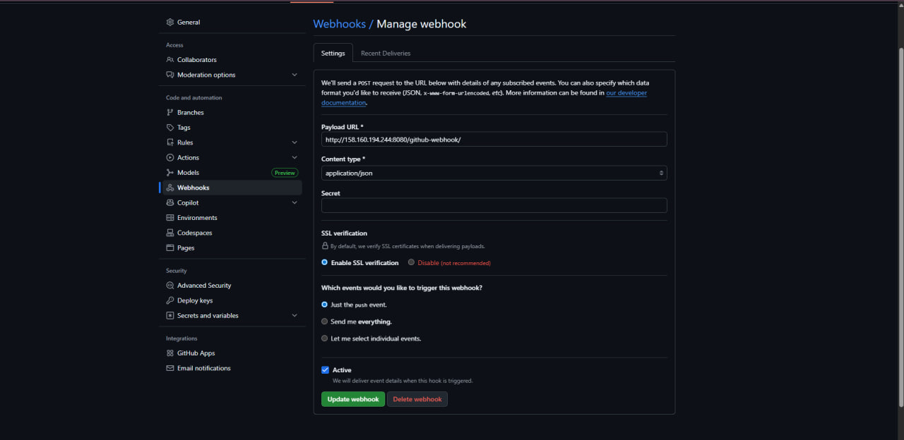
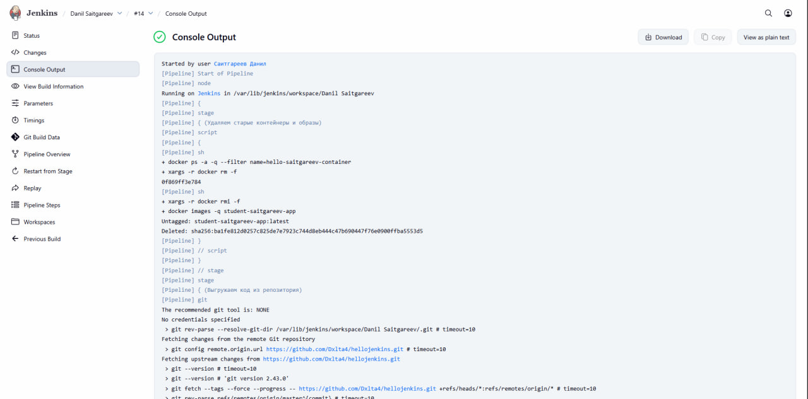
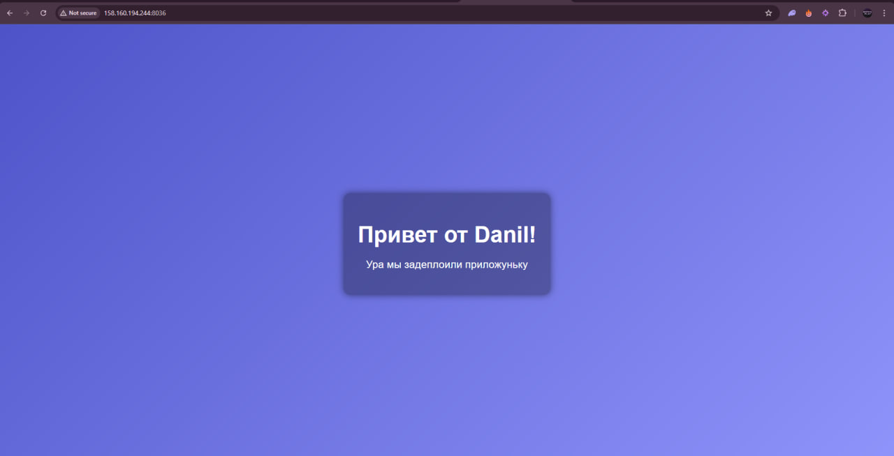

# Отчёт по лабораторной работе №2

## Тема
**Автоматизация сборки и деплоя Python Docker-приложений через Jenkins с интеграцией GitHub.**

## Цель работы
Освоить практические навыки автоматизации процесса непрерывной интеграции и развертывания (CI/CD) с использованием Jenkins — мощного инструмента автоматизации сборки, а также наладить взаимодействие с удалённым репозиторием GitHub посредством webhook, обеспечивающим мгновенный запуск сборки при каждом изменении кода.

В рамках работы создадим собственный Jenkins job, используя готовый Pipeline скрипт (`Jenkinsfile`), освоим управление параметрами сборки, настройку вебхуков для инициирования автоматических сборок, запустим тесты в изолированном Docker-контейнере и развернем приложение с учётом индивидуальных параметров (порт, имя студента).

---

## Ход выполнения работы

### 1. Настройка Jenkins Pipeline
На этом этапе создается Jenkins job с Pipeline-скриптом, который описывает последовательность действий:
- удаление старых контейнеров и образов,
- сборка Docker-образа,
- запуск тестов в контейнере,
- деплой приложения с заданными параметрами.

*Скриншот настройки Jenkins pipeline*  

---

### 2. Создание Webhook
Webhook на GitHub позволяет автоматически запускать сборку Jenkins при каждом push в репозиторий. Настраивается через:
`Settings → Webhooks → Add webhook`, указываем URL Jenkins и тип события `push`.

*Скриншот создания Webhook*  

---

### 3. Сборка Docker-образа
После настроенного Jenkins pipeline и webhook, при каждом пуше в репозиторий Jenkins собирает Docker-образ с приложением и запускает тесты.

*Скриншот успешной сборки*  

---

### 4. Развёрнутая страница приложения
После успешного деплоя приложение доступно по индивидуальному порту и отображает заданное имя студента.

*Скриншот запущенной страницы*  

6. Убедитесь, что GitHub webhook корректно сработал, и Jenkins автоматически запустил повторную сборку.

***
